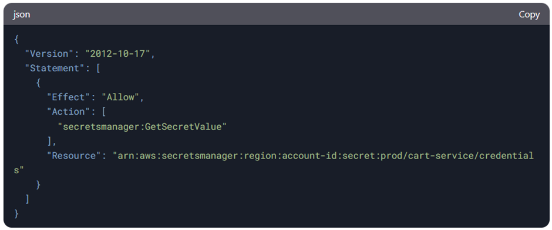

# aws-secret-manager
AWS Secrets Manager is a service that helps securely store, manage, and retrieve sensitive information like API keys, database credentials, and other secrets. Below are several common use cases for AWS Secrets Manager:
1. Storing Database Credentials
•	Scenario: Applications often need to connect to databases using credentials (username and password). Storing these credentials in code or configuration files is insecure.
•	Solution: Use Secrets Manager to store the database credentials securely. Your application can retrieve these credentials at runtime, eliminating the need to hardcode sensitive data.
2. API Key Management
•	Scenario: Many applications rely on third-party APIs and services that require API keys. Storing these keys in the code or environment variables is risky.
•	Solution: Use Secrets Manager to store and manage API keys securely. You can retrieve these keys programmatically when needed.
3. Credential Rotation
•	Scenario: Regularly rotating credentials (such as passwords) is a good security practice. Manually rotating these credentials can be cumbersome and prone to errors.
•	Solution: Secrets Manager can automatically rotate credentials for supported services (like RDS, Redshift, and others), reducing the administrative burden and increasing security by ensuring credentials are always up-to-date.
4. Access Control and Auditability
•	Scenario: You need to control who can access your secrets and track how secrets are used.
•	Solution: Secrets Manager integrates with AWS IAM (Identity and Access Management), enabling fine-grained control over who can access specific secrets. Additionally, AWS CloudTrail logs every action on Secrets Manager, so you can audit access to secrets for compliance.
5. Secure Storage for Encryption Keys
•	Scenario: Encryption keys are critical to securing your sensitive data, and mishandling them can lead to security breaches.
•	Solution: Store encryption keys (e.g., for symmetric or asymmetric encryption) in Secrets Manager, enabling secure access and rotation. Integration with AWS Key Management Service (KMS) provides even more control over encryption key management.
6. Integration with Amazon ECS and Lambda
•	Scenario: In containerized environments (such as Amazon ECS or Lambda), applications need access to sensitive credentials but should avoid embedding them in code or configuration files.
•	Solution: You can retrieve secrets from AWS Secrets Manager programmatically within ECS tasks or Lambda functions, ensuring that sensitive data is not exposed in the code or logs.
7. Managing Service-Specific Credentials
•	Scenario: Services like Amazon RDS, Redshift, or Elasticache often require unique credentials for each instance. Manually managing these credentials across multiple environments can be complex.
•	Solution: Secrets Manager can store and manage these service-specific credentials and, when supported, rotate them automatically, making managing credentials simpler and more secure.
8. Storing SSH Keys
•	Scenario: SSH keys are often used for accessing servers and other resources, and these keys need to be managed securely.
•	Solution: Store SSH private keys in AWS Secrets Manager, ensuring that access is controlled and the keys are rotated periodically.
9. Integration with CI/CD Pipelines
•	Scenario: In continuous integration/continuous deployment (CI/CD) environments, sensitive data like API keys, credentials, or certificates are needed at build and deployment time.
•	Solution: AWS Secrets Manager can be integrated with CI/CD tools (like AWS CodePipeline or Jenkins) to retrieve secrets during build or deployment, ensuring they remain secure and never exposed in the codebase.
10. Multi-Region Secrets Management
•	Scenario: In a globally distributed application, you need to ensure that your secrets are available in multiple regions for redundancy and performance.
•	Solution: Secrets Manager supports replication of secrets across multiple AWS regions, making it easier to manage secrets for globally distributed applications.
 

AWS EC2 (Elastic Compute Cloud) is a web service that provides resizable compute capacity in the cloud. It allows users to launch and manage virtual servers (called instances) on-demand, providing flexibility, scalability, and control over computing resources. Key features of EC2 include:
1.	Scalability: Easily scale up or down based on demand.
2.	Flexibility: Choose from a wide range of instance types, operating systems, and software configurations.
3.	Cost-Effectiveness: Pay only for what you use with options like On-Demand, Reserved, and Spot Instances.
4.	Integration: Seamlessly integrates with other AWS services like S3, RDS, and Lambda.
5.	Security: Provides robust security features like VPC, IAM roles, and security groups.
We need EC2 to host applications, run workloads, and manage infrastructure without the need for physical hardware. It is a foundational service for building and deploying applications in the cloud.

Q1- Authorizing AWS EC2 to Retrieve Secrets from AWS Secrets Manager
To authorize an EC2 instance to retrieve secrets from AWS Secrets Manager, you need to:
1.	Create an IAM Role: Attach a policy to the role that grants permissions to access Secrets Manager.
2.	Attach the Role to the EC2 Instance: Assign the IAM role to the EC2 instance so it can assume the role and access the secrets.
________________________________________
Q2 Derive IAM Policy (JSON) for Accessing Secrets Manager
Below is IAM policy that grants an EC2 instance permission to retrieve a specific secret (prod/cart-service/credentials) from AWS Secrets Manager:

Explanation:
•	Effect: Allow grants permission.
•	Action: secretsmanager:GetSecretValue allows retrieving the secret value.
•	Resource: The ARN of the specific secret in Secrets Manager.
________________________________________
Deriving a Sensible ARN for the Secret
The ARN (Amazon Resource Name) for a secret in AWS Secrets Manager follows this format:
arn:aws:secretsmanager:<region>:<account-id>:secret:<secret-name>
 For the secret prod/cart-service/credentials, the ARN would look like this:
arn:aws:secretsmanager:us-east-1:123456789012:secret:prod/cart-service/credentials
 Breakdown:
•	region: Replace with the AWS region (e.g., us-east-1).
•	account-id: Replace with your AWS account ID (e.g., 123456789012).
•	secret-name: Use the name of the secret (prod/cart-service/credentials).
________________________________________
Steps to Implement:
1.	Create the IAM role with the above policy.
2.	Attach the role to the EC2 instance.
3.	Use the AWS SDK or CLI in your application to retrieve the secret using the secret name or ARN.
This setup ensures secure and authorized access to secrets from AWS Secrets Manager for your EC2 instance.

So, we can understand that AWS Secrets Manager provides a secure, scalable, and flexible way to handle sensitive data such as credentials, API keys, and encryption keys. By automating credential rotation, integrating with AWS services, and providing strong access control, it helps improve security and operational efficiency in cloud-native applications.

Useful references
[1] Mastering AWS Secrets Manager: Effortlessly manage RDS credentials using Terraform 
Mastering AWS Secrets Manager: Effortlessly manage RDS credentials using Terraform 🚀

[2] AWS Secrets Manager: Amazon RDS integration for master user password management
AWS Secrets Manager: Amazon RDS integration for master user password management

[3] IAM roles for Amazon EC2
 https://docs.aws.amazon.com/AWSEC2/latest/UserGuide/iam-roles-for-amazon-ec2.html

[4] Use Parameter Store to Securely Access Secrets and Config Data in AWS CodeDeploy
 https://aws.amazon.com/blogs/mt/use-parameter-store-to-securely-access-secrets-and-config-data-in-aws-codedeploy/

[5] Handling Secrets with AWS Secrets Manager
 https://www.google.com/amp/s/blog.gitguardian.com/handling-secrets-with-aws-secrets-manager/amp/

[6] Access AWS Secrets Manager secret from Amazon EC2 instance using Python
 https://skundunotes.com/2023/11/27/access-aws-secrets-manager-secret-from-amazon-ec2-instance-using-python/

[7] How Do I Access AWS Secrets Manager From an EC2 Instance With IAM Roles?
https://www.pulumi.com/answers/accessing-secrets-manager-from-ec2-with-iam/

[8] How to safely use sensitive data at EC2 launch with Secret Manager?
https://aws.plainenglish.io/how-to-safely-use-sensitive-data-at-ec2-launch-with-secret-manager-6ff9fe9c859

[9] AWS re:Invent 2024 - How to get dynamic with secrets management (SEC204)
https://www.youtube.com/watch?v=sirp8bTHucc

[10] Understanding AWS Secrets Manager - AWS Online Tech Talks
https://www.youtube.com/watch?v=Y3Gn_iP3FlE

[11] Retrieving the Amazon Resource Name (ARN) of the secret in Amazon Redshift
https://docs.aws.amazon.com/redshift/latest/mgmt/redshift-secrets-manager-integration-retrieving-secret.html
